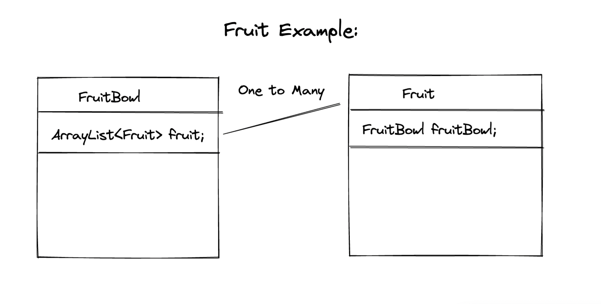
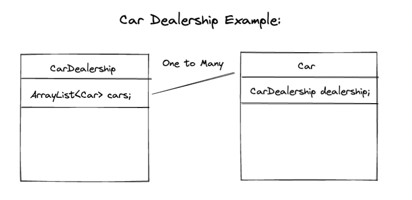
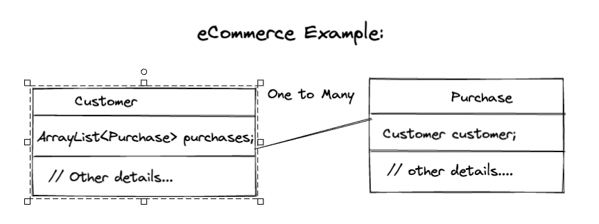

# Database Relationships in JPA - One to Many

## Learning Objectives

* Understand the One-to-many relationship
* Be able to implement a One-to-many relationship using Hibernate/JPA
* Be able to annotate models to set up a database schema describing a one-to-many relationship
* Appreciate why @JsonIgnoreProperties is used to partially suppress output
* Be able to correctly format a POST request when another table is being referenced

## Introduction

So far, we've created some models, some controllers, added some endpoints using multiple HTTP methods such as GET and POST, and even learned a little bit about the importance of seperation of concerns, including how to apply this best practice with the use of a service layer in our application. We've even learned the essentials of persisting data to a Postgres DB via JPA Repositories. So far, however, our models are unrelated to one another. In practice, however, we often need to track relationships between records in our DB. We will be learning about the types of relationships we can create, and how to best track them, in our next couple of lessons.

## One-to-many Relationships

The first type of relationship we will learn about is the one-to-many. You actually worked with one-to-many examples in the SQL lessons, but let's do a little refresher; the best way to understand the different types of relationships is often by considering several theoretical, as well as more concrete, real-world examples. Firstly, think of a bowl of fruit:



If we were to represent this relationship in code, it would be one-to-many - a bowl can have many fruit (in a collection, such as an ArrayList), whereas a fruit can be in only one bowl, not several. Another example of one-to-many would be the relationsip between a car dealership and the cars in it's inventory:



Hopefully those examples help to make the concept of a one-to-many relationship a bit clearer for you. But, you may wonder what would be a common example you'd come accross in real-world programming scenarios? In eCommerce, a great example would be the relationship between a customer and their purchases:



## Creating One-to-Many Relationships in Hibernate/JPA

Thanksfully, a lot of the grunt work of creating relationships between database tables/records is handled for us by Hibernate/JPA. We simply need to mark certain elements of our models and their properties with the appropriate annotations, so Hibernate knows what to do. In our guessing game project, we are going to create a one-to-many relationship between games and player - A player can play many different games over time, but since our example is a single-player game, a game can have only one player. The basic steps we will need to follow are as follows:

- Create a `Player` model, and give it a collection of all the games the player has played
- Annotate this collection as `@OneToMany`
- Add a `player` property to the `Game` model
- Annotate this property as `@ManyToOne`

Some other tasks we will complete, which don't relate directly to the one-to-many concept, but are still essential, are to create a `PlayerService`, a `PlayerController`, and a `PlayerRepository`.

## The Player Model

Let's start by adding a `Player` model to our `models` package, alongside the other models, such as Game, LetterList, Reply etc. The first thing you'll want to do is open this new class up and tell Hibernate that it is an entity, using @Entity: 

```java
@Entity(name = "players")
public class Player {
```

By setting the `name` attribute to `players`, we're telling Hibernate that we want the table in the DB to be called `players` (plural). Otherwise, it would default to the name of the class (Player), which might not cause any errors, but would break with the accepted convention for naming DB tables. 

Next, we'll add our private properties: 

```java
    @Id
    @GeneratedValue(strategy = GenerationType.IDENTITY)
    private long id;

    @Column(name = "name")
    private String name;

    private List<Game> games;

```

Which of the above properties do you think relates to the one-to-many relationship? That's right, `games`! So we need to add an annotation to mark it as such. First we'll add the `@OneToMany` annotation (one *player* to many *games*). 

```java
    @OneToMany(mappedBy = "player")
    @JsonIgnoreProperties({"player"})
    private List<Game> games;
```

We've added `mappedBy = "player"` to tell Hibernate what property on the Game class points back to this player object. The `@JsonIgnoreProperties` annotation prevents an infinite loop when the data is being serialized into JSON - such loops are created when 2 models point to each other, as is the case between Player and Game. `@JsonIgnoreProperties` ensures that we get nice, tidy JSON back, as we would expect.

Next, let's write our constructor:

```java
public Player(String name) {
    this.name = name;
    this.games = new ArrayList<>();
}
```

As you can see, we accept only one argument, `name`, assign it to the `name` property of our new `Player` object, and then initialise the `games` property with an empty `ArrayList`. All fairly straightforward stuff. However, can you pick up on anything that might be missing here? Recall our lesson on POJOs - they must have a default, empty constructor. All our model classes should be POJOs, including Player, so let's add that default constructor below the one we already wrote: 

```java
// a default constructor (required for all POJOs)
public Player() {
}
```

Excellent! Believe it or not, our `Player` model is almost ready - but can you see what else is missing, which a POJO is expected to have by convention? Yes, **getters** and **setters**. Let's add them to the end of our POJO Player class now, after which, your **entire** `Player` model should look like the following:

```java
package com.demos.bnta.word_guesser.models;

import com.fasterxml.jackson.annotation.JsonIgnoreProperties;

import jakarta.persistence.*;
import java.util.ArrayList;
import java.util.List;

@Entity(name = "players")
public class Player {

    @Id
    @GeneratedValue(strategy = GenerationType.IDENTITY)
    private long id;

    @Column(name = "name")
    private String name;

    @OneToMany(mappedBy = "player")
    @JsonIgnoreProperties({"player"})
    private List<Game> games;


    public Player(String name) {
        this.name = name;
        this.games = new ArrayList<>();
    }

    public Player() {
    }

    public long getId() {
        return id;
    }

    public void setId(long id) {
        this.id = id;
    }

    public String getName() {
        return name;
    }

    public void setName(String name) {
        this.name = name;
    }

    public List<Game> getGames() {
        return games;
    }

    public void setGames(List<Game> games) {
        this.games = games;
    }
}

```
And that's everything for the Player model - next, we'll create our PlayerService and PlayerController, respectively.

## The Player Service & Repository

We need a service class to, essentially, act as the manager for our player entity, and handle all dealings with the player repository, which we will also create in this step. Let's start by adding an interface called `PlayerRepository` to the repositories package - functionally, this is much the same as the `GameRepository` interface we created previously:

```java
package com.demos.bnta.word_guesser.repositories;

import com.demos.bnta.word_guesser.models.Player;
import org.springframework.data.jpa.repository.JpaRepository;

public interface PlayerRepository extends JpaRepository<Player, Long> {
}
```

Since this is almost identical to `GameRepository`, there's nothing particularly new here, so let's move on. Please create a class called `PlayerService` in the services package. First, at the top of our new PlayerService class, we need to add the PlayerRepository as a dependency, so we can use it's methods. 

```java
@Autowired
PlayerRepository playerRepository;
```

The `@Autowired` annotation makes sure that a PlayerRepository object gets injected into our PlayerService object upon creation. 

Next, we will add 3 methods which are going to be very useful to us in the PlayerController - getAllPlayers, getPlayerById, and savePlayer, all of which are pretty self-explanatory:

```java
public List<Player> getAllPlayers(){
    return playerRepository.findAll();
}

public Optional<Player> getPlayerById(Long id){
    return playerRepository.findById(id);
}

public Player savePlayer(Player player){
    playerRepository.save(player);
    return player;
}
```

## The Player Controller

Now that we have our model and service classes, we'll need a controller to handle the HTTP requests from the end user. Please create a new class called `PlayerController` in the `controllers` package. Firstly, add the `@RestController` and `@RequestMapping` annotations to it, as we did with GameController:

```java
@RestController
@RequestMapping(value = "/players")
public class PlayerController {
```

As a brief reminder, `@RestController` is basically @Controller and `@ResponseBody` smushed together in one tidy little annotation. It marks the class as a controller for Spring, and indicates that all methods within should return serialized JSON, wihtout having to explicitly state this by adding the `@ResponseBody` annotation to all of them individually. `@RequestMapping` is used to make `/players` the base of all endpoints on this controller.

Next, we'll add our `PlayerService` as a dependency with `@Autowired`:

```java
@Autowired
PlayerService playerService;
```

Doing so gives us access to the methods of `PlayerService`. To finish off our `PlayerController`, we'll need add 3 mappings: `getAllPlayers`, `getPlayerById` and `addNewPlayer`, the function of which is self-explanatory:

```java
 @GetMapping
    public ResponseEntity<List<Player>> getAllPlayers(){
        List<Player> players = playerService.getAllPlayers();
        return new ResponseEntity<>(players, HttpStatus.OK);
    }

    @GetMapping(value = "/{id}")
    public ResponseEntity<Player> getPlayerById(@PathVariable Long id){
        Optional<Player> player = playerService.getPlayerById(id);
        if (player.isPresent()){
            return new ResponseEntity<>(player.get(), HttpStatus.OK);
        } else {
            return new ResponseEntity<>(null, HttpStatus.NOT_FOUND);
        }
    }

    @PostMapping
    public ResponseEntity<Player> addNewPlayer(@RequestBody Player player){
        Player savedPlayer = playerService.savePlayer(player);
        return new ResponseEntity<>(savedPlayer, HttpStatus.CREATED);
    }
```

And that's all of our player classes implemented. Well done!

## Updating the Game Model

Next, we need to update the `Game` model so that it has a property called `player`, which references the the Player object which is associated with the game - this is the *many* side of the one-to-many relationship. Please add the following private property after your existing private properties in the Game class:

```java
@ManyToOne
@JoinColumn(name = "player_id")
@JsonIgnoreProperties({"games"})
private Player player;
```

Notice that, on the *many* side of the one-to-many relationship, we use the `@ManyToOne` annotation, instead of `@OneToMany`, which should only be used on the *one* side. `@JoinColumn` specifies the name of the column to use for the foreign key of the player in the SQL table - in this case, `player_id`. `@JoinColumn` must be used on the many side of the relationship in a one-to-many relationship. It wouldn't work if we put it in the `Player` class instead of `Game`. And as we did in the Player class, we use `@JsonIgnoreProperties` to prevent an infinite loop breaking our JSON output upon serialization.

Please take a look at the existing constructor in `Game` - you'll notice that, presently, it only accepts an argument for the word, not for the player. Let's update it to accept a player argument, and assign it to the player property we just created: 

```java
public Game(String word, Player player) {
    this.guesses = 0;
    this.complete = false;
    this.word = word;
    this.player = player;
}
```

Excellent. We're almost finished updating the Game model - but, remember that `Game`, being a model, should be a POJO, and that POJOs should have getters and setters for *all* private properties. This means that we also need to add in a getter and a setter for the player property, like so:


```java
public Player getPlayer() {
    return player;
}

public void setPlayer(Player player) {
    this.player = player;
}
```

## Updating the Game Service

And that's everything for the model. The GameService class will also need to be updated however - specifically, the startNewGame method, since it calls the Game constructor, which now requires a player object as a second argument. Please updated the existing startNewGame method so that it looks like this: 

```java
 public Reply startNewGame(long playerId){
        String targetWord = wordService.getRandomWord();
        Player player = playerService.getPlayerById(playerId).get();
        Game game = new Game(targetWord, player);
        this.currentWord = Strings.repeat("*", targetWord.length());
        this.guessedLetters = new ArrayList<>();
        gameRepository.save(game);
        return new Reply(
                false,
                this.currentWord,
                String.format("Started new game with id %d", game.getId())
        );
    }
```

Notice how, now, we retrieve the player from the `playerService`, and pass it in as an argument when creating the new `Game`:

```java
Player player = playerService.getPlayerById(playerId).get();
Game game = new Game(targetWord, player);
```

As you can probably already see, the playerService object we're accessing above doesn't exist yet - we need to import it at the top of our class as an @Autowired dependency, like so: 

```java
@Autowired
PlayerService playerService;
```

## Updating the Game Controller

Now let's take a look at the `GameController` class, specifically the `startNewGame` mapping: 
```java
@PostMapping
    public ResponseEntity<Reply> startNewGame(){
        Reply reply = gameService.startNewGame();
        return new ResponseEntity<>(reply, HttpStatus.CREATED);
    }
```

Before this will work correctly, we need to accept a `@RequestParam` called playerId, and pass it to the `GameService` object, like so: 

```java
public ResponseEntity<Reply> startNewGame(@RequestParam long playerId){
Reply reply = gameService.startNewGame(playerId);
```

## Test the Routes

Those are all the code changes we need to make - if the steps were followed successfully, then the routes should all work, but we should test them to confirm. The 2 GET routes can be tested in the browser, but the POST route will need to be tested in Postman. If you run into issues, follow the usual debugging and troubleshooting procedures to work through them.